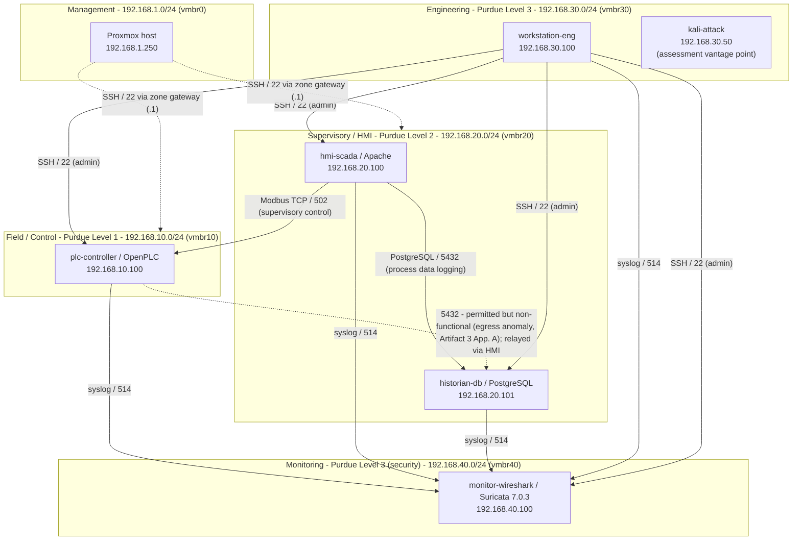

# Zone / Conduit Diagram — Purdue Model Overlay

**Scope:** the OT network's **after-remediation** state — default-deny zone
boundaries with explicitly authorized conduits, as enforced by the Proxmox
host-level firewall (`pve-firewall`) and documented in
[Artifact 3](../artifacts/Artifact-3-Segmentation-Assessment.md).

**Source of truth:** the live firewall state captured in
[`../project-knowledge/LAB-TOPOLOGY.md`](../project-knowledge/LAB-TOPOLOGY.md)
(section "Proxmox firewall configuration") and the conduit list in Artifact 3 §5.
The per-VM `.fw` copies in
[`configs/firewall/network-segmentation/`](../../configs/firewall/network-segmentation/)
are an **August 19 snapshot and are now behind the deployed policy** — see
[Known drift](#known-drift-committed-policy-files-vs-live-state) below. This
diagram is a reading aid, not an independent authority.

---

## Diagram

Every zone boundary is **default-deny inbound** (`policy_in: DROP`). Solid
arrows are the only cross-zone flows the firewall permits; the dashed
PLC&rarr;historian arrow is authorized in policy but does not pass traffic
(see notes). Anything not drawn is blocked.

---

## Authorized conduits

| # | Source | Destination | Port / protocol | Purpose | Policy (live) |
|---|---|---|---|---|---|
| 1 | HMI `192.168.20.100` | PLC `192.168.10.100` | TCP 502 / Modbus | Supervisory control | `101.fw` |
| 2 | HMI `192.168.20.100` | Historian `192.168.20.101` | TCP 5432 / PostgreSQL | Process data logging (added during remediation) | `102.fw` |
| 3 | PLC `192.168.10.100` | Historian `192.168.20.101` | TCP 5432 / PostgreSQL | *Intended* direct logging — **permitted in `102.fw` but non-functional** (egress anomaly, Artifact 3 Appendix A). Data is relayed via conduit 2. | `102.fw` |
| 4 | All OT zones `10/20/30/40.0/24` | Monitor `192.168.40.100` | TCP 514 / syslog | Log / telemetry shipping | `104.fw` |
| 5 | Engineering `192.168.30.0/24` | PLC, HMI, Historian, Monitor | TCP 22 / SSH | Administrative access | `100/101/102/104.fw` |
| 6 | Zone gateway `<zone>.1` (Proxmox host) | PLC `.10.1`, HMI + Historian `.20.1` | TCP 22 / SSH | Host-originated management (Proxmox sources from the bridge-local gateway IP, not the management IP) | `100/101/102.fw` |
| 7 | Management `192.168.1.0/24` | Proxmox host `192.168.1.250` | TCP 8006 / 22 | Hypervisor GUI + SSH | `cluster.fw` |
| 8 | `192.168.10.0/24`, `192.168.20.0/24` | Zone gateway `.1` | ICMP | Gateway reachability check | `cluster.fw` |

The Monitor host (`104.fw`) has **no** gateway-SSH rule — it is administered
over SSH from the Engineering zone only (`ssh -J kali ubuntu@192.168.40.100`).

---

## Purdue Model overlay

| Purdue level | Function | Lab zone (bridge) | Hosts |
|---|---|---|---|
| Level 1 | Basic control — PLC / field logic | Field / Control (`vmbr10`) | `plc-controller` (OpenPLC) |
| Level 2 | Supervisory control, HMI, historian | Supervisory / HMI (`vmbr20`) | `hmi-scada`, `historian-db` |
| Level 3 | Operations / engineering | Engineering (`vmbr30`) | `workstation-eng`, `kali-attack` |
| Level 3 (security) | Monitoring, logging, detection | Monitoring (`vmbr40`) | `monitor-wireshark` (Suricata) |
| — | Hypervisor / out-of-band management | Management (`vmbr0`) | Proxmox host |

The remediation aligned the network to IEC 62443's zones-and-conduits model and
the Purdue separation of Level 1 (Field) from Level 2 (Supervisory), restricting
Level 3 (Engineering) to administrative access only rather than the unrestricted
operational reach it had by default (Artifact 3 §9).

---

## Where this lab diverges from a real plant

Stated explicitly, per assessment methodology — the diagram models a
representative environment, not a claim of a real utility network.

- **No Industrial DMZ (Purdue Level 3.5).** There is no brokered DMZ between the
  Supervisory and Engineering zones; cross-zone flow is mediated only by the
  host-level firewall. An IDMZ is the standard next control and is noted as a
  future improvement in the segmentation case study.
- **No Level 0.** Field instrumentation (sensors, actuators, I/O networks) is not
  modeled; the PLC is the lowest level represented.
- **Single PLC.** One controller stands in for what would be multiple PLCs/RTUs
  across process areas.
- **Monitoring is host-addressed only.** Cross-zone conduit traffic is not
  mirrored to the Monitor (port mirroring paused — see
  [Artifact 6 Mirroring Investigation Handoff](../artifacts/Artifact-6-Mirroring-Investigation-Handoff.md)).
  Suricata currently inspects traffic addressed to the Monitor plus the syslog
  feed (conduit 4), not the HMI&harr;PLC or HMI&harr;historian conduits
  (Finding 6.3).
- **HMI web interface is intra-zone and unencrypted.** Apache on `192.168.20.100`
  serves HTTP with no TLS (Finding 4, open) and has no cross-zone allow rule —
  operator browser access is within the Supervisory zone only.

---

## Known drift: committed policy files vs. live state

The `.fw` files under `configs/firewall/network-segmentation/` were committed
2026-08-19 and have not been re-synced from the deployed policy. As of the
2026-08-30 `LAB-TOPOLOGY.md` capture they differ from live:

| Policy | Committed repo copy | Live / deployed |
|---|---|---|
| `102` (historian) | 5432 from PLC only; no gateway SSH | 5432 from **PLC and HMI**; + SSH from `192.168.20.1` |
| `101` (PLC) | no gateway-SSH rule | + SSH from `192.168.10.1` |
| `100` (HMI) | **absent from repo** | present (SSH-only inbound, from `.20.1` and Engineering) |

Conduit 2 (HMI&rarr;historian) is the operationally important gap — it is the
path the PLC's data actually takes, and it is missing from the committed copy.

There is also a narrative/policy mismatch to reconcile: Artifact 3 §5 states the
historian's 5432 is "permitted only from the HMI's IP (192.168.20.100)", but
both the committed and the live `102.fw` also permit 5432 from the PLC's IP
(`192.168.10.100`) — the conduit 3 rule, kept in place even though the egress
anomaly makes it inert.

**Flagged for the Phase 5.3 / 5.4 passes:** re-export the live `.fw` set into
`configs/firewall/network-segmentation/`, add `100.fw`, and align Artifact 3 §5's
wording with the deployed rule set.

---

## How to read the diagram

- **Boxes** are hosts; **panels** are zones, labeled with their Purdue level,
  subnet, and Proxmox bridge.
- **Solid arrows** are cross-zone flows the firewall actively permits, labeled
  with port and purpose.
- **Dashed arrows** are authorized-but-not-carrying-traffic (conduit 3) or
  host-management paths.
- Direction is the **connection initiator** &rarr; the **listener**.
- Absence of an arrow means the traffic is dropped by the destination zone's
  default-deny inbound policy.
